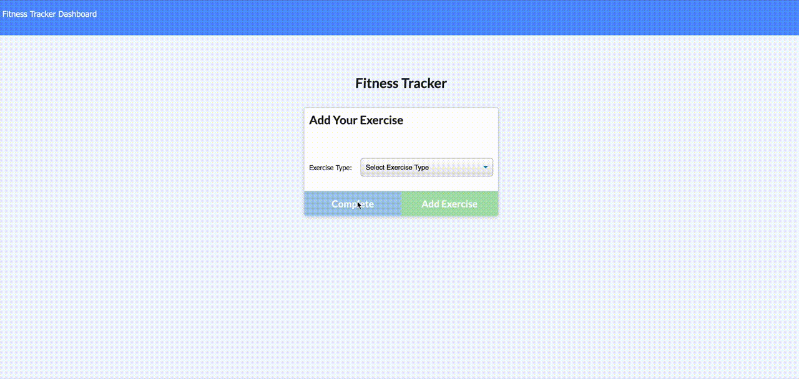

# Fitness-Tracker
Track your fitness

# Description 
Users can use this app to record exercises they've done over time and view the data on a graph.  

# Use

- Click add exercise
- Enter the name of the exercise and what you did. 
- Click add exercise to keep adding to your workout, or click complete workout to finish adding. 
- You can then click dashboard in the upper left hand corner and view your workouts on a graph. 

# Technologies Used
- Node.js
- Javscript
- HTML
- CSS
- Chart.js
- Express.js
- MongoDB

# License
This application uses the MIT license. 

# Challenges
The most challenging part was encoutnering an issue with user access to mongodb through atlas.  The original user I made wasn't working, however, making another user with the same parameters worked.  Not sure what the issue was, but this was the fix for the issue.  

# Future Development 
In the future I would like to add the following features: 

- User login to track individual progress. 
- Add calories burned 
- Make workout plans
- Add workouts to calendar
- Compete with other users. 
